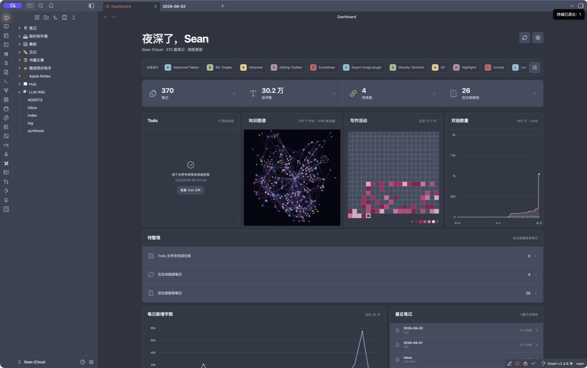

# Dashboard

A calm, interactive home dashboard for Obsidian. Dashboard turns the current
vault into a practical overview of tasks, knowledge connections, writing
activity, note health, installed plugins, recent notes, and top-level folders.

The interface is written in Chinese and uses a Nord-inspired visual language.
All analysis runs locally inside Obsidian.



## What it shows

- Total Markdown notes and total readable word count.
- Notes with no resolved backlinks.
- Empty or very short notes, with a configurable word threshold.
- An editable Todo list sourced only from one explicitly configured Markdown file. It is empty by default.
- An animated perspective-projected 3D galaxy knowledge graph rendered on an isolated 2D canvas, with orbit controls, moving link particles, tooltips, and clickable notes.
- A horizontally scrollable, manually ordered list of installed plugin shortcuts.
- A 365-day writing activity heatmap.
- An interactive 365-day cumulative resolved-link line-area chart.
- A 30-day added-word trend.
- Recently modified notes.
- Note and word totals for each top-level folder.
- Clickable details for every headline metric, issue, date, and folder.

Dashboard opens automatically when the workspace is ready. You can
choose whether it replaces the active tab or opens in a new tab.

## Metric definitions

| Metric | Definition |
| --- | --- |
| Notes | Included `.md` files in the current vault. |
| Total words | Readable CJK characters plus non-CJK word groups after common Markdown syntax, frontmatter, code fences, and comments are removed. |
| No backlinks | Included notes that are not targeted by any resolved link in Obsidian's metadata cache. |
| Empty or very short | Notes whose readable word count is at or below the configured threshold. The default is 10. |
| Open tasks | Unchecked Markdown task items matching `- [ ]` in the configured Todo file only. No task file is read until a path is configured. |
| Added words | Positive word-count deltas observed after the plugin starts tracking. Deletions do not reduce a day's total. |
| Cumulative links | Current resolved metadata-cache links, recorded as an exact daily snapshot after tracking starts. Earlier dates are estimated from each source note's creation date. |

Obsidian files do not contain an exact historical “words added per day” ledger.
For dates before installation, Dashboard can estimate activity by
grouping each note's current word count under its creation date. Estimated
cells use a subtle opacity difference and can be disabled in settings.

## Privacy and safety

- No analytics, network calls, accounts, or cloud service.
- Statistics and activity history stay in
  `.obsidian/plugins/aurora-dashboard/data.json`.
- Daily resolved-link snapshots stay in the same local plugin data file.
- The Todo module reads only the explicitly configured Markdown file and edits it only when you change or complete one of its tasks.
- Excluded folders and their descendants are omitted from every metric.

## Install

### Manual installation

1. Create `.obsidian/plugins/aurora-dashboard/` inside your vault.
2. Copy `main.js`, `manifest.json`, and `styles.css` into that folder.
3. Reload Obsidian.
4. Enable **Dashboard** under **Settings → Community plugins**.

### Community plugin directory

Install **Dashboard** from **Settings → Community plugins → Browse**, or
open its [Obsidian Community listing](https://community.obsidian.md/plugins/aurora-dashboard)
and choose **Add to Obsidian**.

## Commands

- **Dashboard: 打开首页看板**
- **Dashboard: 重新扫描首页统计**

The ribbon dashboard icon also opens the view.

The shortcut strip reads installed plugin manifests from the current vault.
Use its manage button to reorder, remove, or add entries. Selecting a shortcut
opens that plugin's Obsidian detail page through the official `show-plugin` URI.

The knowledge graph uses an isolated Canvas 2D perspective renderer so it does
not compete with Obsidian's built-in graph for a WebGL context. Reduced-motion
system preferences disable continuous star and link particle animation.

## Settings

- Optional greeting name.
- Open on startup.
- Replace the active tab or open a new tab.
- Todo Markdown file path (empty by default).
- Empty/short-note threshold.
- Excluded folders.
- Show or hide estimated pre-install history.
- Activity calendar range: 90, 180, or 365 days.

## Development

Requirements: Node.js 22 and npm.

```bash
npm install
npm run dev
```

Run the complete verification suite:

```bash
npm run check
```

This runs ESLint, Vitest, TypeScript type-checking, and the production esbuild
bundle.

## Release

1. Update `manifest.json`, `package.json`, `versions.json`, and
   `CHANGELOG.md`.
2. Run `npm run check`.
3. Commit the source and metadata changes. `main.js` is generated during the
   release workflow and is intentionally ignored by Git.
4. Push a Git tag exactly equal to the manifest version, without a `v` prefix.
5. The included GitHub Action publishes `main.js`, `manifest.json`, and
   `styles.css` as release assets.
6. Submit the repository through the
   [Obsidian Community plugin submission process](https://docs.obsidian.md/Plugins/Releasing/Submit+your+plugin).

Repository: [tianxiangyu0717-hub/obsidian-aurora-dashboard](https://github.com/tianxiangyu0717-hub/obsidian-aurora-dashboard)

## Compatibility

`minAppVersion` is `1.8.7`. The plugin does not use Node or Electron APIs and
includes narrow-view responsive styles. Hands-on QA currently covers Obsidian
1.13.4 on macOS.

## Design reference

The color system and restrained dark surfaces are inspired by
[insanum/obsidian_nord](https://github.com/insanum/obsidian_nord). Dashboard is
an independent plugin and does not include code or assets from
that theme.

## License

[MIT](LICENSE)
